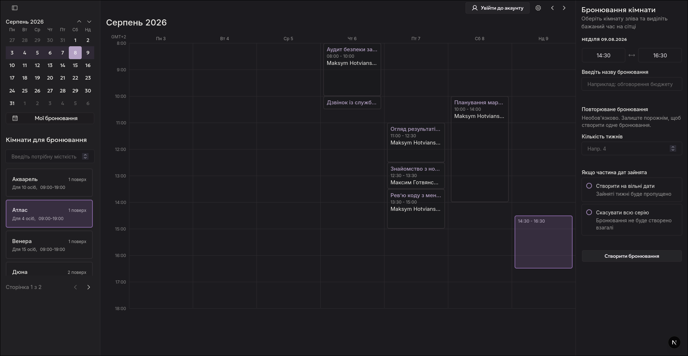
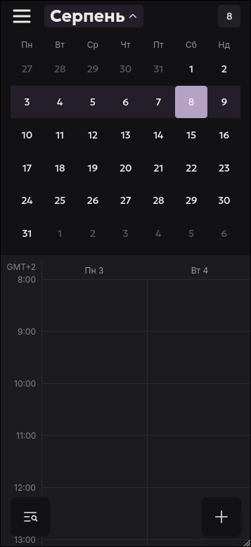

# Бронювання переговорних кімнат

<p align="center">
  
  
</p>


## Зміст
- [Технічні особливості](#технічні-особливості)
- [Початок роботи](#початок-роботи)
- [Дані для входу](#дані-для-входу)
- [Додатково реалізовано](#додатково-реалізовано)

## Технічні особливості
### Виявлення перетину бронювань
**Виявлення перетину інтервалів** реалізовано через запит до бази даних, який знаходить усі наявні активні
бронювання, що перетинаються із запитуваним проміжком часу. Обробник бронювань блокує створення, якщо запит повертає
хоча б один результат:

   ```ts
   return this.databaseService.reservation.findMany({
      where: {
         room_id,
         time_start: { lt: end_date },
         time_end: { gt: start_date },
         status: 'active',
      },
   });
   ```

Щоб цей запит Prisma завжди повертав коректні дані,
написано юніт-тести, які перевіряють правильність результатів цієї функції в усіх можливих сценаріях.
(повний збіг, частковий збіг з кожної сторони, дотикання з кожної сторони, відсутність збігу)

Уникнення стану гонки описано в розділі [Уникнення стану гонки](#уникнення-стану-гонки).

### Форматування часу
1. **Час зберігається в UTC** на стороні сервера. Сервер завжди очікує отримати час у форматі UTC та виконує
   кілька перетворень: наприклад, під час валідації часу він переводить час у київський часовий пояс - для зручності
   розробки. Це зроблено, щоб полегшити розуміння, налагодження та написання юніт-тестів.


2. Сервер повертає час у форматі UTC в усіх відповідях. Клієнт застосовує системний часовий пояс, щоб перетворити його
   на місцевий час користувача.
   Також є сповіщення, яке інформує користувача про різницю в часових поясах (якщо його часовий пояс відрізняється від київського).


3. Важливо зазначити, що **вебзастосунок працює коректно з різними часовими зонами**, тобто, як і зазначено в умовах, людина в Берліні побачить час
   у своїй локальній часовій зоні. Навіть у Токіо все буде працювати :) 

### Скасування бронювання може блокуватися
Цього не було зазначено в технічному завданні, але мені здалося, що це досить логічна поведінка. За замовчуванням сервер не дасть скасувати бронювання за 15 хвилин до його початку.

Це можна відключити, змінивши ```PREVENT_CANCELLATION_BEFORE_MINUTES``` на ```0```.

### Повідомлення про те, що бронювання скоро завершиться

Ці повідомлення створюються разом зі створенням бронювання в тих випадках, коли воно контактує з будь-якими іншими бронюваннями.
Вони створюються однаково як для поодиноких бронювань, так і для серій бронювань.

У випадку якщо перед новим бронюванням є якесь інше, повідомлення створюється для того користувача, чиє бронювання буде першим.
Якщо після бронювання буде інше, то повідомлення створюється для того користувача, який створив бронювання.

Повідомлення не створюються та не надсилаються одразу (тому після створення контактуючого бронювання воно не з'явиться в базі даних).
**Повідомленя створюються саме в час відправки** це зроблено завдяки NestJS черзі, та властивості delay котра відкладає створення повідомлення
до ```Початок наступного бронювання - NOTIFY_BEFORE_MINUTES (env)```

#### Тестування повідомлень

Цю функцію досить тяжко тестувати, тому якщо це потрібно, закоментуйте delay в створенні повідомлення, після чого повідомлення
будуть надсилатися та створюватися в базі даних моментально.

Посилання на файл (54 рядок): - [`notifications-scheduler.service.ts#L54`](./nest-server/src/modules/notifications/services/notification-scheduler.service.ts#L54).
 

## Початок роботи

### Передумови

Перед запуском проєкту переконайтеся, що у вас встановлено Docker і Docker Compose. Інструкції зі встановлення можна
знайти за посиланнями нижче:

- [Docker](https://docs.docker.com/get-docker/)
- [Docker Compose](https://docs.docker.com/compose/install/)

### 1. Клонування репозиторію

```shell
git clone https://github.com/cenaure/Meeting-Room-Booking.git
cd Meeting-Room-Booking
```

### 2. Налаштування файлів середовища

<!-- TODO: перевірити, чи потрібен ще цей розділ, коли Docker Compose використовуватиме готові образи -->

У проєкті є файли середовища, які потрібно налаштувати перед запуском:

- [`.env.example`](./.env.example)
- [`./nest-server/.env.development.local.example`](nest-server/.env.development.local.example)
- [`./next-web/.env.development.local.example`](nest-server/.env.development.local.example)

Для кожного файлу приберіть суфікс `.example`, щоб активувати його.

Проєкт можна запустити в режимі розробки без будь-яких додаткових змін. Для продакшн-режиму обов’язково оновіть
секрети, облікові дані клієнта Google та інші конфіденційні значення.

### 3. Запуск застосунку

З кореневої директорії проєкту:

```shell
docker compose -f docker-compose.development.yml up --build
```

Щоб запустити у фоновому режимі (без виведення логів):

```shell
docker compose -f docker-compose.development.yml up -d --build
```

### 4. Відкриття застосунку

Щойно контейнери запустяться, відкрийте браузер і перейдіть за адресою:

```
http://localhost:3000
```

## Дані для входу
Юзер 1:
```
Email: test1@test.com
Password: 12345678
```

Юзер 2:
```
Email: test2@test.com
Password: 12345678
```

**Кожен із цих користувачів має свій акаунт активований**

## Додатково реалізовано

У цьому розділі описано додаткові фічі, які реалізовано згідно з технічним завдання
(**розділ 05**).

| № | Можливість                               | Опис                                                                                                                                                                     |
|:-:|------------------------------------------|--------------------------------------------------------------------------------------------------------------------------------------------------------------------------|
| 1 | **Запуск однією командою**               | Увесь стек збирається та піднімається через Docker Compose.                                                                                                              |
| 2 | **Підтвердження email**                  | Нові облікові записи активуються через лист. Непідтверджені користувачі не можуть створювати бронювання. Активувати акаунти створені через Google OAuth не потрібно.     |
| 3 | **Щотижневі повторювані бронювання**     | Бронювання кімнати на щотижневій основі. Скасувати можна як окремий запис, так і всю серію.                                                                              |
| 4 | **Уникнення стану гонки**                | Черга обробляє бронювання послідовно — двоє користувачів не можуть зайняти той самий слот. [Детальніше](#уникнення-стану-гонки)                                          |
| 5 | **Сповіщення про завершення бронювання** | Якщо одразу після поточного бронювання починається інше, користувач отримує попередження заздалегідь. [Детальніше](#повідомлення-про-те-що-бронювання-скоро-завершиться) |
| 6 | **Фільтрація за місткістю**              | Пошук доступних кімнат за бажаною місткістю.                                                                                                                             |
| 7 | **Адаптивний інтерфейс**                 | Повна підтримка десктопів, планшетів і мобільних пристроїв.                                                                                                              |

## Уникнення стану гонки
 
Уникнення стану гонки досягається за допомогою черги NestJS, яка обробляє кожне бронювання послідовно: це не дозволяє
двом користувачам одночасно забронювати ту саму кімнату на той самий проміжок часу.

Одна черга обробляє поодинокі бронювання та серії бронювань по одному за раз, використовуючи різні обробники, що
реалізує принцип OCP із SOLID.

Це перше, що прийшло мені на думку, також я виходив із припущення, що застосунок є малим або середнім за розміром, тож послідовна робота черги не буде вузьким
місцем. Якщо ж очікується більша кількість користувачів, які бронюють кімнати, цей підхід можна покращити, створивши
окрему чергу для кожної кімнати.

## Автор

**Максим Готвянський** — [GitHub](https://github.com/cenaure) / [LinkedIn](https://linkedin.com/in/maksym-hotvianskyi-453175339/) / cenaureemail@email.com

Проєкт створено як конкурсну роботу.